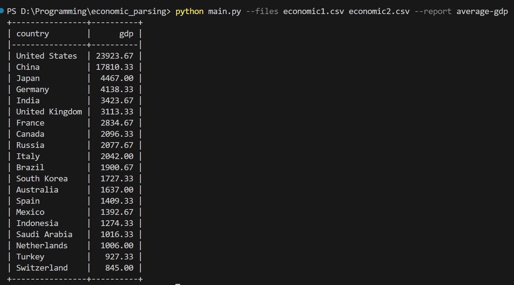

Пример запуска программы:

Для того, чтобы добавить новый отчет, нужно:
1. Создать файл .py в папке reports
2. Создать класс, в котором будет логика отчета
3. Класс должен быть наследован от класса BaseReport
4. В методе get_name() нужно указать имя отчета
5. В методе generate() нужно реализовать логику отчета
Больше ничего делать не нужно. Программа автоматически определяет существующие отчеты.

Можно посмотреть файл reports/average_gdp.py как пример создания отчета.
